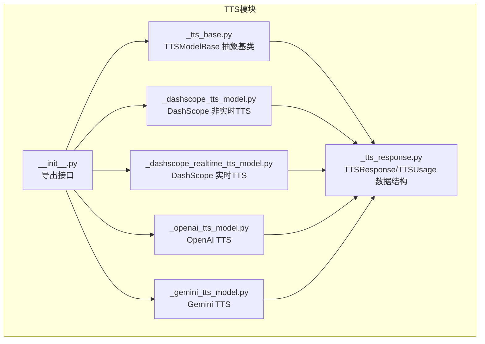
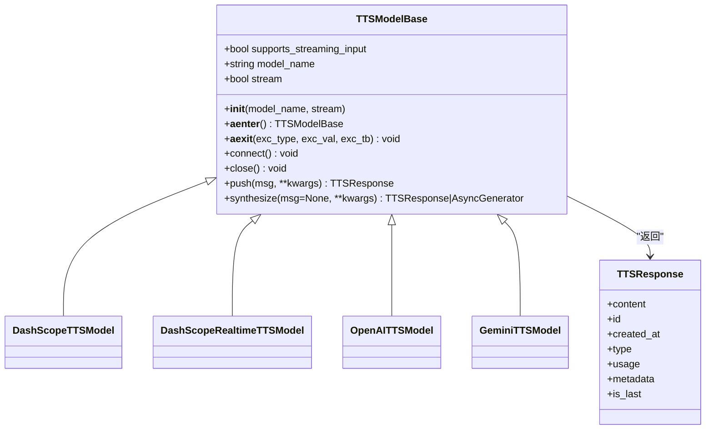
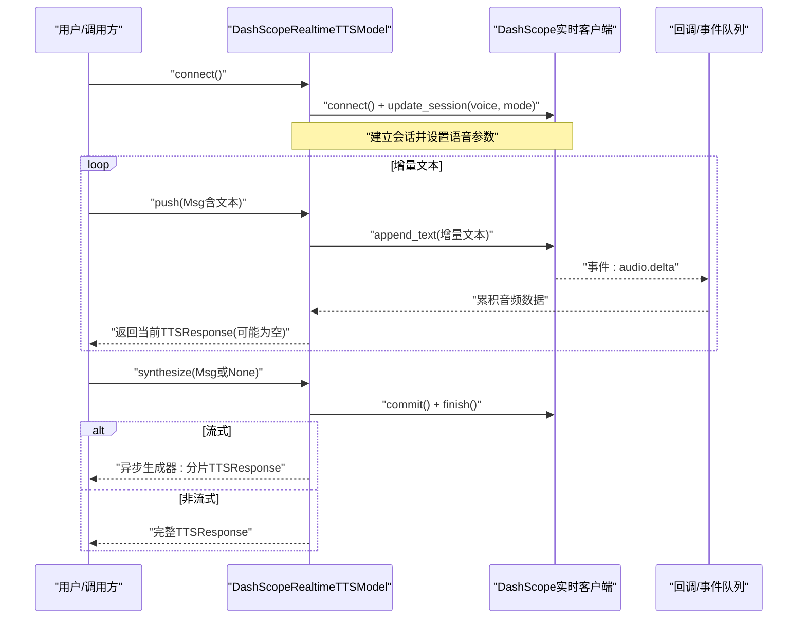
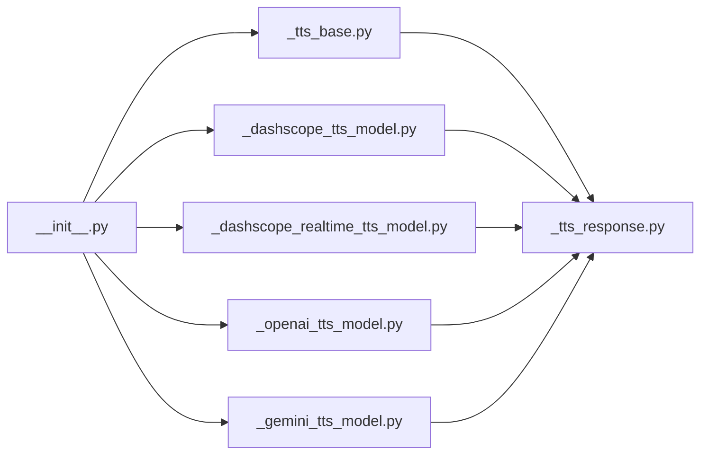

# TTS功能

<cite>
**本文引用的文件列表**
- [src/agentscope/tts/__init__.py](file://src/agentscope/tts/__init__.py)
- [src/agentscope/tts/_tts_base.py](file://src/agentscope/tts/_tts_base.py)
- [src/agentscope/tts/_dashscope_tts_model.py](file://src/agentscope/tts/_dashscope_tts_model.py)
- [src/agentscope/tts/_dashscope_realtime_tts_model.py](file://src/agentscope/tts/_dashscope_realtime_tts_model.py)
- [src/agentscope/tts/_openai_tts_model.py](file://src/agentscope/tts/_openai_tts_model.py)
- [src/agentscope/tts/_gemini_tts_model.py](file://src/agentscope/tts/_gemini_tts_model.py)
- [src/agentscope/tts/_tts_response.py](file://src/agentscope/tts/_tts_response.py)
- [examples/functionality/tts/main.py](file://examples/functionality/tts/main.py)
- [examples/agent/voice_agent/main.py](file://examples/agent/voice_agent/main.py)
- [tests/tts_dashscope_test.py](file://tests/tts_dashscope_test.py)
- [tests/tts_openai_test.py](file://tests/tts_openai_test.py)
- [tests/tts_gemini_test.py](file://tests/tts_gemini_test.py)
</cite>

## 目录
1. [简介](#简介)
2. [项目结构](#项目结构)
3. [核心组件](#核心组件)
4. [架构总览](#架构总览)
5. [详细组件分析](#详细组件分析)
6. [依赖关系分析](#依赖关系分析)
7. [性能考虑](#性能考虑)
8. [故障排查指南](#故障排查指南)
9. [结论](#结论)
10. [附录](#附录)

## 简介
本文件系统性阐述 Agentscope 中的 TTS（文本转语音）模块设计与实现，覆盖以下要点：
- 抽象基类与多提供商实现（DashScope、OpenAI、Gemini）的继承关系与职责划分
- 实时语音合成与普通语音合成的差异、适用场景与交互流程
- 配置参数说明、音频格式支持与性能优化建议
- 通过 voice_agent 示例展示如何在智能体中集成语音输出能力
- 错误处理机制、网络延迟影响与缓存策略
- 提供可直接定位到源码位置的路径，便于进一步阅读与扩展

## 项目结构
TTS 模块位于 agentscope/tts 目录，采用“按提供商拆分”的组织方式：每个提供商一个具体实现类，统一继承自抽象基类；同时提供统一的导出入口与响应数据结构。

图表来源
- [src/agentscope/tts/__init__.py](file://src/agentscope/tts/__init__.py#L1-L20)
- [src/agentscope/tts/_tts_base.py](file://src/agentscope/tts/_tts_base.py#L1-L144)
- [src/agentscope/tts/_dashscope_tts_model.py](file://src/agentscope/tts/_dashscope_tts_model.py#L1-L178)
- [src/agentscope/tts/_dashscope_realtime_tts_model.py](file://src/agentscope/tts/_dashscope_realtime_tts_model.py#L1-L446)
- [src/agentscope/tts/_openai_tts_model.py](file://src/agentscope/tts/_openai_tts_model.py#L1-L185)
- [src/agentscope/tts/_gemini_tts_model.py](file://src/agentscope/tts/_gemini_tts_model.py#L1-L211)
- [src/agentscope/tts/_tts_response.py](file://src/agentscope/tts/_tts_response.py#L1-L56)

章节来源
- [src/agentscope/tts/__init__.py](file://src/agentscope/tts/__init__.py#L1-L20)

## 核心组件
- 抽象基类 TTSModelBase：定义统一的生命周期与接口规范，包括非实时合成 synthesize、实时合成 push/connect/close 等方法约定，以及 supports_streaming_input、model_name、stream 等通用属性。
- 具体实现：
  - DashScopeTTSModel：基于 DashScope 多模态对话 API 的非实时 TTS，支持流式与非流式两种模式。
  - DashScopeRealtimeTTSModel：基于 DashScope 实时 TTS SDK 的实时合成，支持增量推送与异步流式返回。
  - OpenAITTSModel：基于 OpenAI Speech API 的 TTS，支持流式与非流式。
  - GeminiTTSModel：基于 Google Gemini 的 TTS，支持流式与非流式。
- 响应与用量：TTSResponse 封装音频内容、时间戳、类型、是否最后一帧等；TTSUsage 记录输入/输出 token 与耗时。

章节来源
- [src/agentscope/tts/_tts_base.py](file://src/agentscope/tts/_tts_base.py#L1-L144)
- [src/agentscope/tts/_dashscope_tts_model.py](file://src/agentscope/tts/_dashscope_tts_model.py#L1-L178)
- [src/agentscope/tts/_dashscope_realtime_tts_model.py](file://src/agentscope/tts/_dashscope_realtime_tts_model.py#L1-L446)
- [src/agentscope/tts/_openai_tts_model.py](file://src/agentscope/tts/_openai_tts_model.py#L1-L185)
- [src/agentscope/tts/_gemini_tts_model.py](file://src/agentscope/tts/_gemini_tts_model.py#L1-L211)
- [src/agentscope/tts/_tts_response.py](file://src/agentscope/tts/_tts_response.py#L1-L56)

## 架构总览
TTS 模块遵循“抽象基类 + 多提供商实现 + 统一响应”的分层设计。所有实现均复用统一的数据结构与消息通道，便于在智能体中以一致的方式接入语音输出。

图表来源
- [src/agentscope/tts/_tts_base.py](file://src/agentscope/tts/_tts_base.py#L1-L144)
- [src/agentscope/tts/_dashscope_tts_model.py](file://src/agentscope/tts/_dashscope_tts_model.py#L1-L178)
- [src/agentscope/tts/_dashscope_realtime_tts_model.py](file://src/agentscope/tts/_dashscope_realtime_tts_model.py#L1-L446)
- [src/agentscope/tts/_openai_tts_model.py](file://src/agentscope/tts/_openai_tts_model.py#L1-L185)
- [src/agentscope/tts/_gemini_tts_model.py](file://src/agentscope/tts/_gemini_tts_model.py#L1-L211)
- [src/agentscope/tts/_tts_response.py](file://src/agentscope/tts/_tts_response.py#L1-L56)

## 详细组件分析

### 抽象基类：TTSModelBase
- 职责：为所有 TTS 实现提供统一接口与生命周期管理；区分实时与非实时两类语义。
- 关键点：
  - supports_streaming_input：标记是否支持实时增量输入。
  - 生命周期：非实时模型无需连接；实时模型通过 async context 或显式 connect/close 管理资源。
  - 接口：
    - synthesize：非实时合成或等待实时合成完成。
    - push：实时增量推送文本，非阻塞地返回已收到的音频片段。
  - 返回值：统一使用 TTSResponse，支持 is_last 标记与 AsyncGenerator 流式输出。

章节来源
- [src/agentscope/tts/_tts_base.py](file://src/agentscope/tts/_tts_base.py#L1-L144)

### DashScope 非实时 TTS：DashScopeTTSModel
- 特性：
  - 支持流式与非流式两种模式，内部通过 DashScope 多模态对话 API 调用。
  - 非实时模型不支持增量输入，需一次性传入完整文本。
- 关键参数：
  - api_key、model_name、voice、language_type、stream、generate_kwargs。
- 输出：
  - 非流式：返回完整音频的 TTSResponse。
  - 流式：逐段累积音频数据，逐段产出 TTSResponse，最后产出 is_last=True 的最终帧。

章节来源
- [src/agentscope/tts/_dashscope_tts_model.py](file://src/agentscope/tts/_dashscope_tts_model.py#L1-L178)

### DashScope 实时 TTS：DashScopeRealtimeTTSModel
- 特性：
  - 支持实时增量输入，内部使用 DashScope 实时 TTS SDK。
  - 支持冷启动阈值（按字符数或按空格分词的词数）避免首段过短导致停顿。
  - 同一实例仅能处理单条消息的增量输入序列，不同消息 ID 会触发错误。
- 生命周期：
  - connect/update_session 初始化会话与语音参数。
  - push 增量推送文本，返回当前已累积的音频片段。
  - synthesize 在提交后阻塞等待完整音频，或返回异步流式生成器。
- 关键参数：
  - api_key、model_name、voice、stream、cold_start_length、cold_start_words、client_kwargs、generate_kwargs。

图表来源
- [src/agentscope/tts/_dashscope_realtime_tts_model.py](file://src/agentscope/tts/_dashscope_realtime_tts_model.py#L1-L446)

章节来源
- [src/agentscope/tts/_dashscope_realtime_tts_model.py](file://src/agentscope/tts/_dashscope_realtime_tts_model.py#L1-L446)

### OpenAI TTS：OpenAITTSModel
- 特性：
  - 基于 OpenAI Speech API，支持流式与非流式。
  - 非实时模型不支持增量输入，需一次性传入完整文本。
- 关键参数：
  - api_key、model_name、voice、stream、client_kwargs、generate_kwargs。
- 输出：
  - 非流式：返回完整音频的 TTSResponse。
  - 流式：按字节块迭代，逐块编码为 base64 并产出 TTSResponse，最后 is_last=True。

章节来源
- [src/agentscope/tts/_openai_tts_model.py](file://src/agentscope/tts/_openai_tts_model.py#L1-L185)

### Gemini TTS：GeminiTTSModel
- 特性：
  - 基于 Google Gemini 的 TTS，支持流式与非流式。
  - 非实时模型不支持增量输入，需一次性传入完整文本。
- 关键参数：
  - api_key、model_name、voice、stream、client_kwargs、generate_kwargs。
- 输出：
  - 非流式：提取 inline_data 的音频数据与 MIME 类型，封装为 TTSResponse。
  - 流式：迭代响应块，累积 base64 音频数据，逐块产出 TTSResponse，最后返回空内容用于结束信号。

章节来源
- [src/agentscope/tts/_gemini_tts_model.py](file://src/agentscope/tts/_gemini_tts_model.py#L1-L211)

### 响应与用量：TTSResponse/TTSUsage
- TTSResponse：封装音频内容（AudioBlock）、时间戳、类型、是否最后一帧、元数据与用量信息。
- TTSUsage：记录输入/输出 token 与耗时，类型固定为 “tts”。

章节来源
- [src/agentscope/tts/_tts_response.py](file://src/agentscope/tts/_tts_response.py#L1-L56)

## 依赖关系分析
- 导出入口：__init__.py 将抽象基类与各提供商实现统一导出，便于外部按名称导入。
- 内部依赖：各实现类依赖 TTSResponse 数据结构；实时模型额外依赖 DashScope 实时 SDK 回调与事件队列。
- 外部依赖：DashScope、OpenAI、Google GenAI 官方 SDK。

图表来源
- [src/agentscope/tts/__init__.py](file://src/agentscope/tts/__init__.py#L1-L20)
- [src/agentscope/tts/_tts_base.py](file://src/agentscope/tts/_tts_base.py#L1-L144)
- [src/agentscope/tts/_dashscope_tts_model.py](file://src/agentscope/tts/_dashscope_tts_model.py#L1-L178)
- [src/agentscope/tts/_dashscope_realtime_tts_model.py](file://src/agentscope/tts/_dashscope_realtime_tts_model.py#L1-L446)
- [src/agentscope/tts/_openai_tts_model.py](file://src/agentscope/tts/_openai_tts_model.py#L1-L185)
- [src/agentscope/tts/_gemini_tts_model.py](file://src/agentscope/tts/_gemini_tts_model.py#L1-L211)
- [src/agentscope/tts/_tts_response.py](file://src/agentscope/tts/_tts_response.py#L1-L56)

## 性能考虑
- 流式 vs 非流式
  - 非流式：一次性请求，适合短文本与低延迟要求的场景，减少网络往返。
  - 流式：分块传输，适合长文本与需要边听边播的场景，降低首包延迟感知。
- 实时合成
  - DashScope 实时模型支持增量输入，结合冷启动阈值可避免首段过短导致的停顿。
  - 注意：同一实例仅能处理单条消息的增量序列，跨消息会报错，需在上层进行消息 ID 管理。
- 音频格式
  - 不同提供商默认输出格式不同，需根据下游播放器或存储格式选择合适 response_format 或 MIME 类型。
  - 建议在上层统一转换为期望的采样率与编码格式，以提升兼容性。
- 缓存策略
  - 对相同文本的重复合成结果可做缓存（基于文本哈希），但需注意语音参数（如 voice、style）变化会导致缓存失效。
  - 对于实时流式，建议仅缓存最终完整音频，避免部分片段的缓存一致性问题。
- 网络与并发
  - 实时模型在同一实例内串行处理增量输入，避免并发冲突；若需要多路并发，应使用多个实例或在上层排队。
  - 对外暴露的异步生成器需及时消费，避免背压导致内存增长。

[本节为通用性能建议，不直接分析具体文件，故无章节来源]

## 故障排查指南
- 连接与生命周期
  - 实时模型未 connect 即调用 push/synthesize 会抛出运行时错误；请先调用 async with 或显式 connect。
  - 同一实例不支持跨消息的增量输入，不同消息 ID 会触发错误；确保所有增量属于同一 Msg.id。
- 参数校验
  - 语音参数（voice、model_name）需与提供商文档一致；错误的 voice 可能导致合成失败或异常音质。
  - generate_kwargs/client_kwargs 需符合对应 SDK 的签名，避免关键字冲突。
- 流式消费
  - 流式生成器必须持续消费，否则可能导致 SDK 端缓冲积压或超时。
  - 非流式合成在某些提供商下可能返回空内容，需检查输入文本与网络状态。
- 单元测试参考
  - 可参考各提供商的测试用例，验证初始化、流式/非流式行为与边界条件。

章节来源
- [src/agentscope/tts/_dashscope_realtime_tts_model.py](file://src/agentscope/tts/_dashscope_realtime_tts_model.py#L327-L446)
- [tests/tts_dashscope_test.py](file://tests/tts_dashscope_test.py#L1-L322)
- [tests/tts_openai_test.py](file://tests/tts_openai_test.py#L1-L136)
- [tests/tts_gemini_test.py](file://tests/tts_gemini_test.py#L1-L168)

## 结论
TTS 模块通过抽象基类统一了接口与生命周期，使 DashScope、OpenAI、Gemini 等多家提供商的实现具备一致的使用体验。非实时模型适合短文本与低延迟场景，实时模型适合长文本与边听边播场景。通过合理的参数配置、流式消费与缓存策略，可在保证质量的同时提升整体性能与用户体验。

[本节为总结性内容，不直接分析具体文件，故无章节来源]

## 附录

### 实时语音合成与普通语音合成对比
- 普通语音合成（非实时）
  - 输入：完整文本一次性提交
  - 输出：完整音频或流式分块（逐块累积）
  - 适用：短文本、快速回复、批量任务
- 实时语音合成（实时）
  - 输入：增量文本分批推送，保持 Msg.id 一致
  - 输出：增量音频分块，支持冷启动阈值避免首段停顿
  - 适用：长文本朗读、对话式语音助手、多轮交互

章节来源
- [src/agentscope/tts/_tts_base.py](file://src/agentscope/tts/_tts_base.py#L1-L144)
- [src/agentscope/tts/_dashscope_realtime_tts_model.py](file://src/agentscope/tts/_dashscope_realtime_tts_model.py#L1-L446)

### 配置参数说明（按提供商）
- 通用参数
  - model_name：模型名称（各提供商支持列表见实现注释）
  - stream：是否启用流式合成
  - generate_kwargs：提供商特定的生成参数（如 temperature、seed）
- DashScope
  - api_key、voice、language_type、generate_kwargs
  - 实时模型：voice、cold_start_length、cold_start_words、client_kwargs
- OpenAI
  - api_key、model_name、voice、client_kwargs、generate_kwargs
- Gemini
  - api_key、model_name、voice、client_kwargs、generate_kwargs

章节来源
- [src/agentscope/tts/_dashscope_tts_model.py](file://src/agentscope/tts/_dashscope_tts_model.py#L1-L178)
- [src/agentscope/tts/_dashscope_realtime_tts_model.py](file://src/agentscope/tts/_dashscope_realtime_tts_model.py#L1-L446)
- [src/agentscope/tts/_openai_tts_model.py](file://src/agentscope/tts/_openai_tts_model.py#L1-L185)
- [src/agentscope/tts/_gemini_tts_model.py](file://src/agentscope/tts/_gemini_tts_model.py#L1-L211)

### 音频格式支持
- DashScope：默认输出 PCM，采样率与 MIME 类型由提供商决定；可按需转换。
- OpenAI：非流式默认 PCM，流式默认 mp3（在实现中转换为 base64）。
- Gemini：返回 inline_data 的原始音频数据与 MIME 类型，需按需转换。

章节来源
- [src/agentscope/tts/_dashscope_tts_model.py](file://src/agentscope/tts/_dashscope_tts_model.py#L100-L178)
- [src/agentscope/tts/_openai_tts_model.py](file://src/agentscope/tts/_openai_tts_model.py#L90-L185)
- [src/agentscope/tts/_gemini_tts_model.py](file://src/agentscope/tts/_gemini_tts_model.py#L120-L211)

### 在智能体中集成语音输出（voice_agent 示例）
- voice_agent 示例展示了如何在 ReActAgent 中接入语音输出（OpenAI 兼容模式），并通过 generate_kwargs 指定 modalities 与音频参数。
- functionality/tts 示例展示了如何在 ReActAgent 中接入 DashScope 实时 TTS，实现边写边播的语音反馈。

章节来源
- [examples/agent/voice_agent/main.py](file://examples/agent/voice_agent/main.py#L1-L51)
- [examples/functionality/tts/main.py](file://examples/functionality/tts/main.py#L1-L57)

### 错误处理机制与网络延迟影响
- 错误处理
  - 实时模型在未连接状态下调用 push/synthesize 会抛出运行时错误；跨消息增量输入会抛出运行时错误。
  - 流式生成器需持续消费，避免背压；非流式可能返回空内容，需检查输入与网络。
- 网络延迟
  - 流式合成可显著降低首包延迟，改善交互体验；实时模型通过冷启动阈值减少首段停顿。
  - 建议在网络不稳定时启用重试与超时控制，并在上层对流式输出进行缓冲与丢弃策略。

章节来源
- [src/agentscope/tts/_dashscope_realtime_tts_model.py](file://src/agentscope/tts/_dashscope_realtime_tts_model.py#L327-L446)
- [tests/tts_openai_test.py](file://tests/tts_openai_test.py#L1-L136)
- [tests/tts_gemini_test.py](file://tests/tts_gemini_test.py#L1-L168)

### 缓存策略
- 文本级缓存：对相同文本+语音参数组合的结果进行缓存，避免重复网络请求。
- 片段级缓存：实时流式场景建议仅缓存最终完整音频，避免部分片段的缓存一致性问题。
- 失效策略：当 voice、model_name、generate_kwargs 发生变化时，应清空对应缓存。

[本节为通用策略建议，不直接分析具体文件，故无章节来源]

### 实际代码示例（路径定位）
- 初始化 DashScope 非实时 TTS 并合成
  - 参考：[src/agentscope/tts/_dashscope_tts_model.py](file://src/agentscope/tts/_dashscope_tts_model.py#L78-L135)
- 初始化 DashScope 实时 TTS 并增量推送
  - 参考：[src/agentscope/tts/_dashscope_realtime_tts_model.py](file://src/agentscope/tts/_dashscope_realtime_tts_model.py#L304-L378)
- 初始化 OpenAI TTS 并流式合成
  - 参考：[src/agentscope/tts/_openai_tts_model.py](file://src/agentscope/tts/_openai_tts_model.py#L76-L137)
- 初始化 Gemini TTS 并流式合成
  - 参考：[src/agentscope/tts/_gemini_tts_model.py](file://src/agentscope/tts/_gemini_tts_model.py#L79-L173)
- 在智能体中集成语音输出（voice_agent）
  - 参考：[examples/agent/voice_agent/main.py](file://examples/agent/voice_agent/main.py#L1-L51)
- 在智能体中集成实时语音输出（functionality/tts）
  - 参考：[examples/functionality/tts/main.py](file://examples/functionality/tts/main.py#L1-L57)