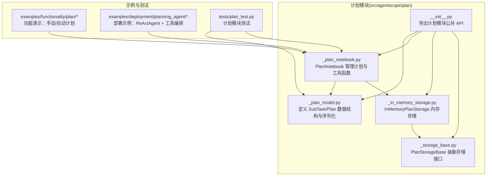
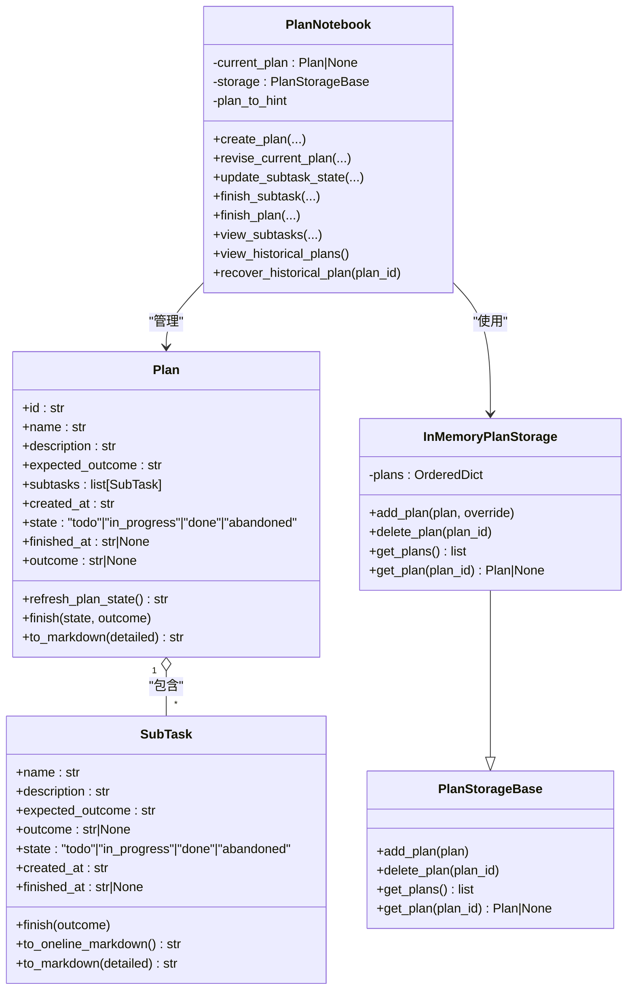
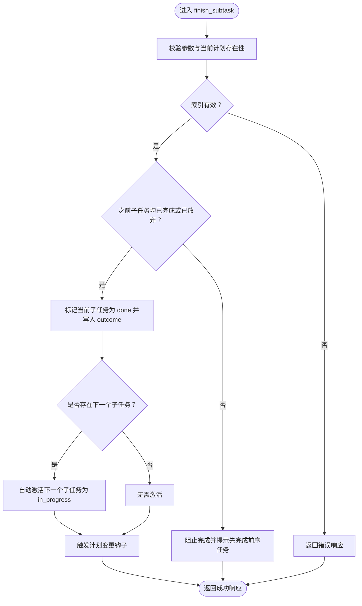
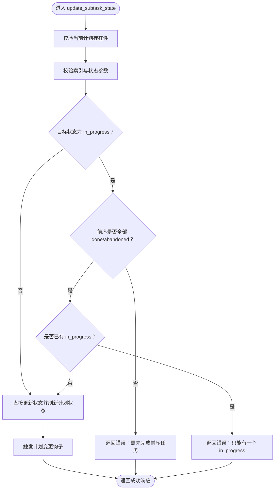
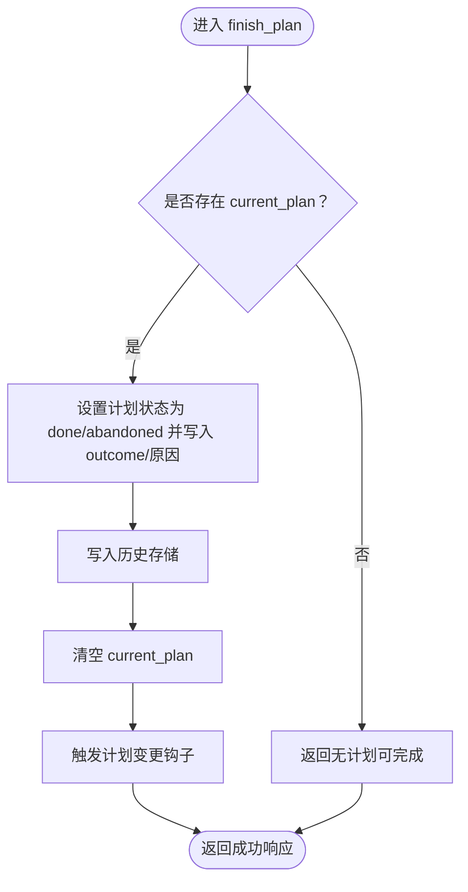
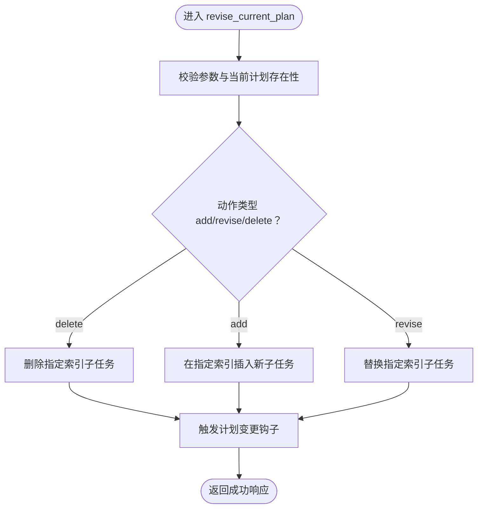
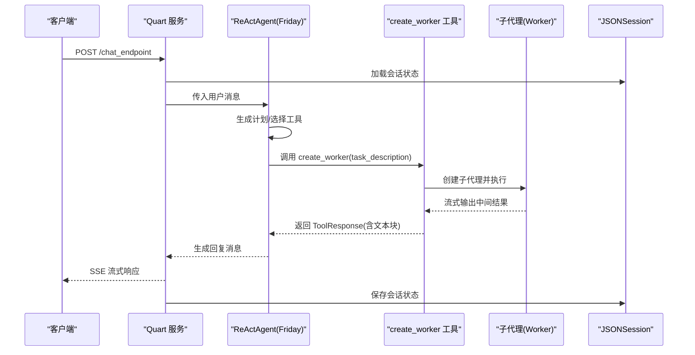
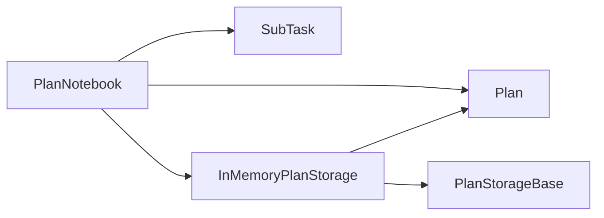

# 计划系统

<cite>
**本文引用的文件列表**
- [src/agentscope/plan/_plan_notebook.py](file://src/agentscope/plan/_plan_notebook.py)
- [src/agentscope/plan/_plan_model.py](file://src/agentscope/plan/_plan_model.py)
- [src/agentscope/plan/_in_memory_storage.py](file://src/agentscope/plan/_in_memory_storage.py)
- [src/agentscope/plan/_storage_base.py](file://src/agentscope/plan/_storage_base.py)
- [src/agentscope/plan/__init__.py](file://src/agentscope/plan/__init__.py)
- [examples/functionality/plan/main_agent_managed_plan.py](file://examples/functionality/plan/main_agent_managed_plan.py)
- [examples/functionality/plan/main_manual_plan.py](file://examples/functionality/plan/main_manual_plan.py)
- [examples/deployment/planning_agent/main.py](file://examples/deployment/planning_agent/main.py)
- [examples/deployment/planning_agent/tool.py](file://examples/deployment/planning_agent/tool.py)
- [tests/plan_test.py](file://tests/plan_test.py)
</cite>

## 目录
1. [引言](#引言)
2. [项目结构](#项目结构)
3. [核心组件](#核心组件)
4. [架构总览](#架构总览)
5. [详细组件分析](#详细组件分析)
6. [依赖关系分析](#依赖关系分析)
7. [性能考量](#性能考量)
8. [故障排查指南](#故障排查指南)
9. [结论](#结论)
10. [附录：自定义计划策略最佳实践](#附录自定义计划策略最佳实践)

## 引言
本文件系统性讲解计划系统（Plan）的设计与实现，重点覆盖以下方面：
- _plan_notebook 模块如何管理任务分解、进度跟踪与目标达成评估
- _plan_model 中定义的计划数据结构及其状态机转换逻辑
- _in_memory_storage 提供的临时存储机制及其适用场景
- 通过 planning_agent 示例展示自动化任务规划的实际应用，包括工具调用协调与多步骤执行流程
- 创建自定义计划策略的指导，涵盖异常处理、回滚机制与用户反馈集成的最佳实践

## 项目结构
计划系统位于 src/agentscope/plan 目录下，包含模型、笔记本、存储与基类；examples 下提供功能演示与部署示例；tests 提供单元测试验证行为。

图表来源
- [src/agentscope/plan/_plan_model.py](file://src/agentscope/plan/_plan_model.py#L1-L201)
- [src/agentscope/plan/_plan_notebook.py](file://src/agentscope/plan/_plan_notebook.py#L1-L899)
- [src/agentscope/plan/_in_memory_storage.py](file://src/agentscope/plan/_in_memory_storage.py#L1-L71)
- [src/agentscope/plan/_storage_base.py](file://src/agentscope/plan/_storage_base.py#L1-L27)
- [src/agentscope/plan/__init__.py](file://src/agentscope/plan/__init__.py#L1-L22)
- [examples/functionality/plan/main_agent_managed_plan.py](file://examples/functionality/plan/main_agent_managed_plan.py#L1-L66)
- [examples/functionality/plan/main_manual_plan.py](file://examples/functionality/plan/main_manual_plan.py#L1-L102)
- [examples/deployment/planning_agent/main.py](file://examples/deployment/planning_agent/main.py#L1-L130)
- [examples/deployment/planning_agent/tool.py](file://examples/deployment/planning_agent/tool.py#L1-L227)
- [tests/plan_test.py](file://tests/plan_test.py#L1-L200)

章节来源
- [src/agentscope/plan/_plan_model.py](file://src/agentscope/plan/_plan_model.py#L1-L201)
- [src/agentscope/plan/_plan_notebook.py](file://src/agentscope/plan/_plan_notebook.py#L1-L899)
- [src/agentscope/plan/_in_memory_storage.py](file://src/agentscope/plan/_in_memory_storage.py#L1-L71)
- [src/agentscope/plan/_storage_base.py](file://src/agentscope/plan/_storage_base.py#L1-L27)
- [src/agentscope/plan/__init__.py](file://src/agentscope/plan/__init__.py#L1-L22)

## 核心组件
- 计划数据模型
  - SubTask：子任务数据结构，包含名称、描述、期望结果、实际结果、状态、时间戳等字段，并提供完成标记与 Markdown 序列化能力
  - Plan：计划数据结构，包含唯一标识、名称、描述、期望结果、子任务列表、时间戳、整体状态与完成信息，并提供刷新计划状态与完成标记能力
- 计划笔记本（PlanNotebook）
  - 负责计划生命周期管理：创建、修订、状态更新、完成与历史记录查看/恢复
  - 提供提示生成器（默认 DefaultPlanToHint），根据当前计划状态生成系统提示，引导智能体下一步行动
  - 支持钩子（hooks）在计划变更时触发（如前端展示）
  - 默认使用 InMemoryPlanStorage 存储历史计划
- 存储抽象与实现
  - PlanStorageBase：抽象存储接口
  - InMemoryPlanStorage：基于有序字典的内存存储，支持状态序列化/反序列化

章节来源
- [src/agentscope/plan/_plan_model.py](file://src/agentscope/plan/_plan_model.py#L1-L201)
- [src/agentscope/plan/_plan_notebook.py](file://src/agentscope/plan/_plan_notebook.py#L1-L899)
- [src/agentscope/plan/_in_memory_storage.py](file://src/agentscope/plan/_in_memory_storage.py#L1-L71)
- [src/agentscope/plan/_storage_base.py](file://src/agentscope/plan/_storage_base.py#L1-L27)

## 架构总览
计划系统采用“数据模型 + 笔记本 + 存储”的分层设计：
- 数据模型层：SubTask/Plan 定义计划的数据结构与序列化
- 控制层：PlanNotebook 提供计划生命周期管理与提示生成
- 存储层：PlanStorageBase 抽象 + InMemoryPlanStorage 实现，支持历史计划持久化与恢复

图表来源
- [src/agentscope/plan/_plan_model.py](file://src/agentscope/plan/_plan_model.py#L1-L201)
- [src/agentscope/plan/_plan_notebook.py](file://src/agentscope/plan/_plan_notebook.py#L1-L899)
- [src/agentscope/plan/_in_memory_storage.py](file://src/agentscope/plan/_in_memory_storage.py#L1-L71)
- [src/agentscope/plan/_storage_base.py](file://src/agentscope/plan/_storage_base.py#L1-L27)

## 详细组件分析

### 计划数据模型（SubTask/Plan）
- 设计要点
  - 使用 Pydantic BaseModel 进行字段校验与序列化
  - SubTask 的状态机：todo → in_progress → done 或 abandoned
  - Plan 的状态机：todo/in_progress → done/abandoned；refresh_plan_state 基于子任务状态自动切换
  - 提供 to_markdown/detailed 输出，便于人类阅读与调试
- 复杂度与性能
  - 状态刷新 refresh_plan_state 遍历子任务，复杂度 O(n)，n 为子任务数量
  - 序列化/反序列化依赖 model_dump/model_validate，开销与字段数量线性相关
- 错误处理
  - 字段类型与取值范围由 Pydantic 自动校验
  - finish/outcome 等关键字段在完成时统一写入时间戳，避免空洞状态

章节来源
- [src/agentscope/plan/_plan_model.py](file://src/agentscope/plan/_plan_model.py#L1-L201)

### 计划笔记本（PlanNotebook）
- 功能职责
  - 计划创建：create_plan 接收名称、描述、期望结果与子任务列表，构建 Plan 并设置为 current_plan
  - 计划修订：revise_current_plan 支持在指定位置 add/revise/delete 子任务
  - 子任务状态管理：update_subtask_state 严格约束并发与顺序（同一时刻仅一个 in_progress，且必须按序推进）
  - 子任务完成：finish_subtask 标记完成并自动激活下一个子任务
  - 计划完成/放弃：finish_plan 将当前计划写入历史存储并清空 current_plan
  - 历史查询/恢复：view_historical_plans 与 recover_historical_plan
  - 提示生成：DefaultPlanToHint 根据计划状态生成系统提示，指导下一步行动
  - 钩子：_plan_change_hooks 在计划变更时触发（如前端展示）
- 关键流程图（子任务完成）

图表来源
- [src/agentscope/plan/_plan_notebook.py](file://src/agentscope/plan/_plan_notebook.py#L543-L647)

- 关键流程图（子任务状态更新）

图表来源
- [src/agentscope/plan/_plan_notebook.py](file://src/agentscope/plan/_plan_notebook.py#L428-L542)

- 关键流程图（计划完成）

图表来源
- [src/agentscope/plan/_plan_notebook.py](file://src/agentscope/plan/_plan_notebook.py#L689-L732)

- 关键流程图（修订计划）

图表来源
- [src/agentscope/plan/_plan_notebook.py](file://src/agentscope/plan/_plan_notebook.py#L303-L427)

章节来源
- [src/agentscope/plan/_plan_notebook.py](file://src/agentscope/plan/_plan_notebook.py#L1-L899)

### 提示生成器（DefaultPlanToHint）
- 设计思路
  - 根据当前计划的子任务状态分布（todo、in_progress、done、abandoned）生成不同阶段的系统提示
  - 提示包裹在特定标签内，便于智能体识别与处理
- 使用方式
  - 可通过 PlanNotebook 的 plan_to_hint 注入自定义提示生成器，默认使用 DefaultPlanToHint

章节来源
- [src/agentscope/plan/_plan_notebook.py](file://src/agentscope/plan/_plan_notebook.py#L16-L170)

### 存储层（PlanStorageBase 与 InMemoryPlanStorage）
- 抽象接口
  - PlanStorageBase 定义 add_plan/delete_plan/get_plans/get_plan 四个异步方法
- 内存实现
  - InMemoryPlanStorage 基于 OrderedDict 维护计划映射，支持注册状态序列化/反序列化，便于会话持久化
  - 提供 override 控制重复 ID 的处理策略
- 适用场景
  - 临时会话、单进程运行、快速原型开发
  - 不适用于跨进程/跨实例共享或需要长期持久化的场景

章节来源
- [src/agentscope/plan/_storage_base.py](file://src/agentscope/plan/_storage_base.py#L1-L27)
- [src/agentscope/plan/_in_memory_storage.py](file://src/agentscope/plan/_in_memory_storage.py#L1-L71)

### 自动化任务规划示例（planning_agent）
- 入口与路由
  - main.py 提供 HTTP SSE 流式聊天端点，接收用户输入并驱动 ReActAgent 执行
- 工具编排
  - tool.py 定义 create_worker 工具，动态创建子工作流代理（Worker），组合多种 MCP 客户端与本地文件工具
  - 通过 stream_printing_messages 实时输出中间过程，支持中断信号
- 多步骤执行流程
  - 主代理（Friday）负责拆解任务、创建计划、协调子代理执行
  - 子代理（Worker）专注具体子任务，最终以结构化结果返回
- 会话管理
  - 使用 JSONSession 保存/加载状态，确保计划与工具状态在会话间延续

图表来源
- [examples/deployment/planning_agent/main.py](file://examples/deployment/planning_agent/main.py#L1-L130)
- [examples/deployment/planning_agent/tool.py](file://examples/deployment/planning_agent/tool.py#L1-L227)

章节来源
- [examples/deployment/planning_agent/main.py](file://examples/deployment/planning_agent/main.py#L1-L130)
- [examples/deployment/planning_agent/tool.py](file://examples/deployment/planning_agent/tool.py#L1-L227)

### 功能演示（功能示例）
- 自动计划（ReActAgent + PlanNotebook）
  - main_agent_managed_plan.py 展示启用元工具后，智能体可自动创建与管理计划
- 手动计划
  - main_manual_plan.py 展示手动创建计划并驱动智能体执行

章节来源
- [examples/functionality/plan/main_agent_managed_plan.py](file://examples/functionality/plan/main_agent_managed_plan.py#L1-L66)
- [examples/functionality/plan/main_manual_plan.py](file://examples/functionality/plan/main_manual_plan.py#L1-L102)

## 依赖关系分析
- 模块耦合
  - PlanNotebook 依赖 SubTask/Plan（数据模型）、InMemoryPlanStorage（默认存储）、StateModule（状态管理）
  - InMemoryPlanStorage 依赖 PlanStorageBase（抽象）与 Plan（序列化）
- 外部依赖
  - ReActAgent、Toolkit、MCP 客户端、JSONSession 等用于示例与部署
- 循环依赖
  - 无循环依赖，模块边界清晰

图表来源
- [src/agentscope/plan/_plan_notebook.py](file://src/agentscope/plan/_plan_notebook.py#L1-L899)
- [src/agentscope/plan/_plan_model.py](file://src/agentscope/plan/_plan_model.py#L1-L201)
- [src/agentscope/plan/_in_memory_storage.py](file://src/agentscope/plan/_in_memory_storage.py#L1-L71)
- [src/agentscope/plan/_storage_base.py](file://src/agentscope/plan/_storage_base.py#L1-L27)

章节来源
- [src/agentscope/plan/_plan_notebook.py](file://src/agentscope/plan/_plan_notebook.py#L1-L899)
- [src/agentscope/plan/_plan_model.py](file://src/agentscope/plan/_plan_model.py#L1-L201)
- [src/agentscope/plan/_in_memory_storage.py](file://src/agentscope/plan/_in_memory_storage.py#L1-L71)
- [src/agentscope/plan/_storage_base.py](file://src/agentscope/plan/_storage_base.py#L1-L27)

## 性能考量
- 状态刷新
  - refresh_plan_state 对子任务遍历，复杂度 O(n)；建议控制子任务规模或在批量操作时合并更新
- 序列化
  - model_dump/model_validate 与 OrderedDict 序列化/反序列化成本与字段数量线性相关；历史计划较多时注意内存占用
- I/O
  - InMemoryPlanStorage 为内存操作，延迟低；若扩展到持久化存储，需考虑序列化/反序列化与磁盘 I/O 开销
- 并发
  - 子任务并发限制（同一时刻仅一个 in_progress）避免了竞态，但可能影响吞吐；可通过更细粒度的任务拆分缓解

## 故障排查指南
- 常见问题与定位
  - 当前计划为空：调用 create_plan 前会抛出异常或返回错误响应，检查是否正确创建计划
  - 子任务索引越界：update_subtask_state/finish_subtask/view_subtasks 会返回错误提示，核对子任务数量与索引
  - 状态约束失败：当尝试将子任务设为 in_progress 时，若前序未完成或已有 in_progress，会返回错误；按顺序推进
  - 历史计划不存在：recover_historical_plan 未找到 ID 时返回提示；确认历史查询结果中的 ID
- 单元测试参考
  - tests/plan_test.py 覆盖了计划创建、修订、状态更新、完成与历史恢复的关键路径，可作为行为对照与回归测试依据

章节来源
- [tests/plan_test.py](file://tests/plan_test.py#L1-L200)
- [tests/plan_test.py](file://tests/plan_test.py#L387-L613)

## 结论
计划系统通过清晰的数据模型与严格的控制流程，提供了从任务分解、进度跟踪到目标达成评估的完整能力。PlanNotebook 以工具函数与提示生成为核心，结合 InMemoryPlanStorage 实现了可追踪、可恢复的计划生命周期管理。部署示例展示了如何在真实场景中协调工具与多步骤执行，形成可扩展的自动化任务规划框架。

## 附录：自定义计划策略最佳实践
- 异常处理
  - 在工具函数中捕获并包装异常，返回明确的错误消息与上下文，便于上层决策
  - 对外部依赖（如 MCP 客户端）增加超时与重试策略，避免阻塞主流程
- 回滚机制
  - 在 finish_subtask 前记录前序状态快照；若后续失败，可调用 revise_current_plan 恢复或删除失败子任务
  - 对不可逆操作（如文件写入）提供撤销/回退方案
- 用户反馈集成
  - 使用 ToolResponse 的 content 字段承载结构化文本块，结合 SSE 流式输出，提升交互体验
  - 在关键节点（如计划创建、修订、完成）通过钩子通知前端更新视图
- 状态一致性
  - 使用 StateModule 的状态序列化/反序列化能力，确保计划与工具状态在会话间一致
  - 对历史存储实现自定义 PlanStorageBase 子类，满足跨实例共享与长期持久化需求