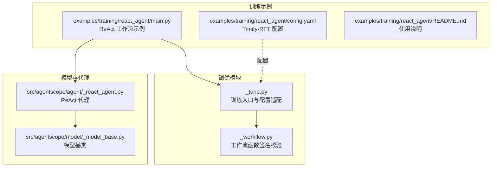
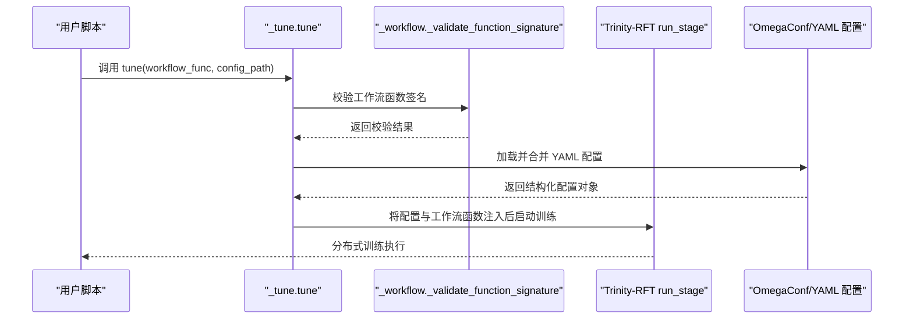
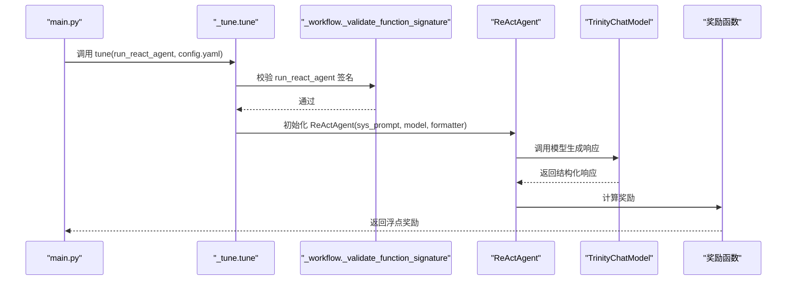
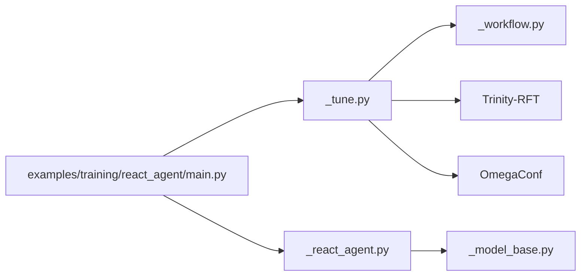

# 调优功能

<cite>
**本文引用的文件列表**
- [src/agentscope/tune/_tune.py](file://src/agentscope/tune/_tune.py)
- [src/agentscope/tune/_workflow.py](file://src/agentscope/tune/_workflow.py)
- [examples/training/react_agent/main.py](file://examples/training/react_agent/main.py)
- [examples/training/react_agent/config.yaml](file://examples/training/react_agent/config.yaml)
- [tests/tune_test.py](file://tests/tune_test.py)
- [examples/training/react_agent/README.md](file://examples/training/react_agent/README.md)
- [src/agentscope/model/_model_base.py](file://src/agentscope/model/_model_base.py)
- [src/agentscope/agent/_react_agent.py](file://src/agentscope/agent/_react_agent.py)
</cite>

## 目录
1. [简介](#简介)
2. [项目结构](#项目结构)
3. [核心组件](#核心组件)
4. [架构总览](#架构总览)
5. [详细组件分析](#详细组件分析)
6. [依赖关系分析](#依赖关系分析)
7. [性能考虑](#性能考虑)
8. [故障排查指南](#故障排查指南)
9. [结论](#结论)
10. [附录](#附录)

## 简介
本文件系统性阐述调优（Tune）模块的功能与使用方法，重点覆盖：
- 在 _tune.py 中实现的训练入口与配置加载逻辑，以及与 Trinity-RFT 的集成方式
- 在 _workflow.py 中定义的工作流函数签名校验机制，保障训练工作流的输入输出契约
- 通过 React Agent 训练示例展示如何用 YAML 配置文件定义调优任务，以及提示模板、温度等参数对智能体性能的影响
- 分布式调优的扩展思路与资源管理建议，帮助高效利用计算资源

## 项目结构
调优相关的核心代码位于 src/agentscope/tune 下，训练示例位于 examples/training/react_agent。调优模块通过外部库 Trinity-RFT 完成实际的分布式训练与调度。

图表来源
- [src/agentscope/tune/_tune.py](file://src/agentscope/tune/_tune.py#L1-L73)
- [src/agentscope/tune/_workflow.py](file://src/agentscope/tune/_workflow.py#L1-L78)
- [examples/training/react_agent/main.py](file://examples/training/react_agent/main.py#L1-L99)
- [examples/training/react_agent/config.yaml](file://examples/training/react_agent/config.yaml#L1-L65)
- [src/agentscope/model/_model_base.py](file://src/agentscope/model/_model_base.py#L1-L78)
- [src/agentscope/agent/_react_agent.py](file://src/agentscope/agent/_react_agent.py#L421-L457)

章节来源
- [src/agentscope/tune/_tune.py](file://src/agentscope/tune/_tune.py#L1-L73)
- [src/agentscope/tune/_workflow.py](file://src/agentscope/tune/_workflow.py#L1-L78)
- [examples/training/react_agent/main.py](file://examples/training/react_agent/main.py#L1-L99)
- [examples/training/react_agent/config.yaml](file://examples/training/react_agent/config.yaml#L1-L65)
- [examples/training/react_agent/README.md](file://examples/training/react_agent/README.md#L48-L145)

## 核心组件
- 训练入口与配置适配：负责加载 YAML 配置、校验工作流函数签名、将工作流函数注入到 Trinity-RFT 的配置中并启动训练阶段
- 工作流函数签名校验：严格约束异步工作流函数的输入输出类型，确保与训练框架契约一致
- 训练示例：基于 ReAct 代理的工作流，演示如何在训练中使用提示模板、温度等参数，并通过奖励函数量化性能

章节来源
- [src/agentscope/tune/_tune.py](file://src/agentscope/tune/_tune.py#L10-L73)
- [src/agentscope/tune/_workflow.py](file://src/agentscope/tune/_workflow.py#L17-L78)
- [examples/training/react_agent/main.py](file://examples/training/react_agent/main.py#L53-L88)

## 架构总览
调优模块采用“配置驱动 + 工作流适配”的架构：用户通过 YAML 文件提供训练配置，调优入口将其转换为 Trinity-RFT 可识别的配置，并将自定义工作流函数注入其中，最终由 Trinity-RFT 启动分布式训练流程。

图表来源
- [src/agentscope/tune/_tune.py](file://src/agentscope/tune/_tune.py#L10-L73)
- [src/agentscope/tune/_workflow.py](file://src/agentscope/tune/_workflow.py#L20-L78)

## 详细组件分析

### 组件一：训练入口与配置适配（_tune.py）
- 功能要点
  - 异常处理：当缺少 Trinity-RFT 依赖时抛出明确的导入错误
  - 函数签名校验：委托给 _workflow 模块进行严格校验
  - 配置加载：使用 OmegaConf 结构化模式加载 YAML，合并默认 schema 与用户配置
  - 配置适配：将工作流函数注入到 Trinity-RFT 的任务集参数中，并设置默认工作流类型
  - 启动训练：调用 Trinity-RFT 的 run_stage 执行训练阶段

- 关键数据结构与复杂度
  - 配置加载与合并：时间复杂度近似 O(N)，N 为配置项数量；空间复杂度 O(N)
  - 函数签名校验：时间复杂度 O(P)，P 为参数个数（固定为 2），空间复杂度 O(1)

- 错误处理与边界条件
  - 缺少依赖：捕获 ImportError 并给出安装指引
  - 签名不匹配：返回 False 或抛出异常，阻止不兼容的工作流进入训练
  - 配置无效：捕获合并异常并抛出格式错误

- 性能与可维护性
  - 通过结构化 schema 与类型注解减少运行期错误
  - 将配置与训练入口解耦，便于扩展新的算法或同步策略

章节来源
- [src/agentscope/tune/_tune.py](file://src/agentscope/tune/_tune.py#L10-L73)

### 组件二：工作流函数签名校验（_workflow.py）
- 功能要点
  - 类型约束：要求工作流函数为异步，且仅接受两个参数（task: Dict, model: TrinityChatModel），返回 float
  - 参数名称与类型检查：逐项比对参数名与类型注解
  - 返回类型检查：确保返回值为浮点数
  - 日志记录：对不符合规范的签名输出警告信息

- 复杂度分析
  - 时间复杂度 O(P)，P 为参数个数（固定为 2）
  - 空间复杂度 O(1)

- 与训练流程的关系
  - 在 _tune.py 中被调用，作为训练前的契约检查，避免后续阶段出现类型不匹配导致的崩溃

- 测试验证
  - 单元测试覆盖了正确与多种错误签名的场景，确保校验逻辑稳定可靠

章节来源
- [src/agentscope/tune/_workflow.py](file://src/agentscope/tune/_workflow.py#L17-L78)
- [tests/tune_test.py](file://tests/tune_test.py#L1-L68)

### 组件三：训练示例（React Agent）
- 使用 YAML 配置定义训练任务
  - 算法选择：多步推理的 GRPO 算法
  - 模型参数：最大响应长度、上下文长度等
  - 集群与资源：节点数、每节点 GPU 数、批大小、同步方式等
  - 探索器与训练器：并行探索器实例数、超时、动态同步间隔、保存间隔等
  - 监控：TensorBoard 监控类型

- 提示模板与温度参数对性能的影响
  - 提示模板：系统提示词直接影响代理的推理方向与行为
  - 温度参数：在 rollout 阶段用于控制采样多样性，影响探索质量与稳定性
  - 奖励函数：基于数学题答案的格式化评分，量化代理回答质量

- 代码级流程
  - 工作流函数接收 task 与 model，构造 ReAct 代理，生成结构化响应，计算奖励并返回浮点数

图表来源
- [examples/training/react_agent/main.py](file://examples/training/react_agent/main.py#L53-L88)
- [examples/training/react_agent/config.yaml](file://examples/training/react_agent/config.yaml#L1-L65)
- [src/agentscope/agent/_react_agent.py](file://src/agentscope/agent/_react_agent.py#L421-L457)

章节来源
- [examples/training/react_agent/main.py](file://examples/training/react_agent/main.py#L53-L88)
- [examples/training/react_agent/config.yaml](file://examples/training/react_agent/config.yaml#L1-L65)
- [examples/training/react_agent/README.md](file://examples/training/react_agent/README.md#L48-L145)
- [src/agentscope/agent/_react_agent.py](file://src/agentscope/agent/_react_agent.py#L421-L457)

### 组件四：提示模板与温度参数的影响分析
- 提示模板
  - 系统提示词决定代理的角色定位与推理策略，直接影响最终答案的结构与准确性
  - 在示例中，系统提示词强调“使用工具解决数学问题”，并要求最终答案以特定格式呈现
- 温度参数
  - 在 rollout 阶段通过配置文件中的温度控制采样多样性
  - 更高的温度会增加探索性但可能降低稳定性，更低的温度更稳定但可能限制探索
- 奖励函数
  - 基于数学题答案的格式化评分，结合真值进行对比，量化代理回答质量

章节来源
- [examples/training/react_agent/main.py](file://examples/training/react_agent/main.py#L63-L87)
- [examples/training/react_agent/config.yaml](file://examples/training/react_agent/config.yaml#L36-L36)

## 依赖关系分析
- 内部依赖
  - _tune.py 依赖 _workflow.py 的类型约束校验
  - 训练示例依赖 ReAct 代理与模型基类
- 外部依赖
  - Trinity-RFT：训练框架，负责分布式训练与调度
  - OmegaConf：配置解析与合并
  - Ray：示例文档中建议的集群管理工具

图表来源
- [src/agentscope/tune/_tune.py](file://src/agentscope/tune/_tune.py#L10-L73)
- [src/agentscope/tune/_workflow.py](file://src/agentscope/tune/_workflow.py#L17-L78)
- [examples/training/react_agent/main.py](file://examples/training/react_agent/main.py#L53-L88)
- [src/agentscope/agent/_react_agent.py](file://src/agentscope/agent/_react_agent.py#L421-L457)
- [src/agentscope/model/_model_base.py](file://src/agentscope/model/_model_base.py#L1-L78)

章节来源
- [src/agentscope/tune/_tune.py](file://src/agentscope/tune/_tune.py#L10-L73)
- [src/agentscope/tune/_workflow.py](file://src/agentscope/tune/_workflow.py#L17-L78)
- [examples/training/react_agent/main.py](file://examples/training/react_agent/main.py#L53-L88)

## 性能考虑
- 配置层面
  - 批大小与动态批大小：根据显存情况调整训练批大小与动态批大小策略
  - 上下文长度与响应长度：在保证性能的前提下尽量提升上下文长度，避免 OOM
  - 同步策略：动态同步与 NCCL 等通信方式的选择会影响收敛速度与稳定性
- 资源层面
  - GPU 数量与并行探索器实例数：合理分配每节点 GPU 数与探索器实例数，平衡吞吐与延迟
  - 保存间隔与监控：定期保存检查点，使用 TensorBoard 追踪指标
- 算法层面
  - 多步推理算法：重复采样次数与探索器并行度共同决定样本效率
  - 温度与多样性：在探索与稳定之间取得平衡，避免过度发散或过早收敛

[本节为通用指导，不直接分析具体文件]

## 故障排查指南
- 导入错误
  - 现象：提示缺少 Trinity-RFT 依赖
  - 处理：按照提示安装 Trinity-RFT 后重试
- 工作流函数签名不匹配
  - 现象：校验失败，日志输出警告
  - 处理：确保函数为异步，参数名为 task 与 model，类型分别为 Dict 与 TrinityChatModel，返回值为 float
- 配置文件格式错误
  - 现象：合并配置时报错
  - 处理：检查 YAML 格式与字段命名，确保与 Trinity-RFT schema 兼容
- 训练阶段异常
  - 现象：分布式训练过程中断
  - 处理：检查集群连接、GPU 显存、同步方式与超时设置；适当降低批大小或增加超时

章节来源
- [src/agentscope/tune/_tune.py](file://src/agentscope/tune/_tune.py#L18-L32)
- [src/agentscope/tune/_workflow.py](file://src/agentscope/tune/_workflow.py#L20-L78)
- [tests/tune_test.py](file://tests/tune_test.py#L1-L68)

## 结论
调优模块通过严格的函数签名校验与配置驱动的方式，将用户自定义的工作流函数无缝接入 Trinity-RFT 的分布式训练框架。训练示例展示了如何通过提示模板与温度参数影响智能体性能，并借助奖励函数量化结果。结合合理的资源配置与同步策略，可在多 GPU 环境中高效完成大规模训练任务。

[本节为总结性内容，不直接分析具体文件]

## 附录

### A. 调优算法与搜索策略说明
- 当前实现聚焦于配置驱动的训练流程，未内置网格搜索或随机搜索等传统超参搜索策略
- 若需进行超参搜索，可在外部通过批量运行不同配置文件的方式实现，或在上层封装中引入搜索策略并结合现有配置加载机制

[本节为概念性说明，不直接分析具体文件]

### B. 分布式调优扩展方案与资源管理建议
- 集群准备
  - 使用 Ray 启动单机或多机集群，确保各节点可达与共享存储可用
- 资源分配
  - 合理设置每节点 GPU 数与探索器实例数，避免显存不足
  - 控制批大小与动态批大小，平衡吞吐与内存占用
- 同步与通信
  - 选择合适的同步方式与通信后端（如 NCCL），并设置合理的同步间隔与超时
- 监控与日志
  - 使用 TensorBoard 追踪指标，定期保存检查点以便恢复与回放

[本节为通用指导，不直接分析具体文件]