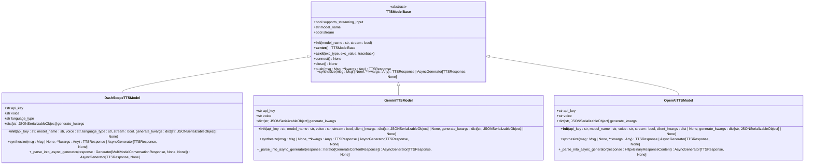
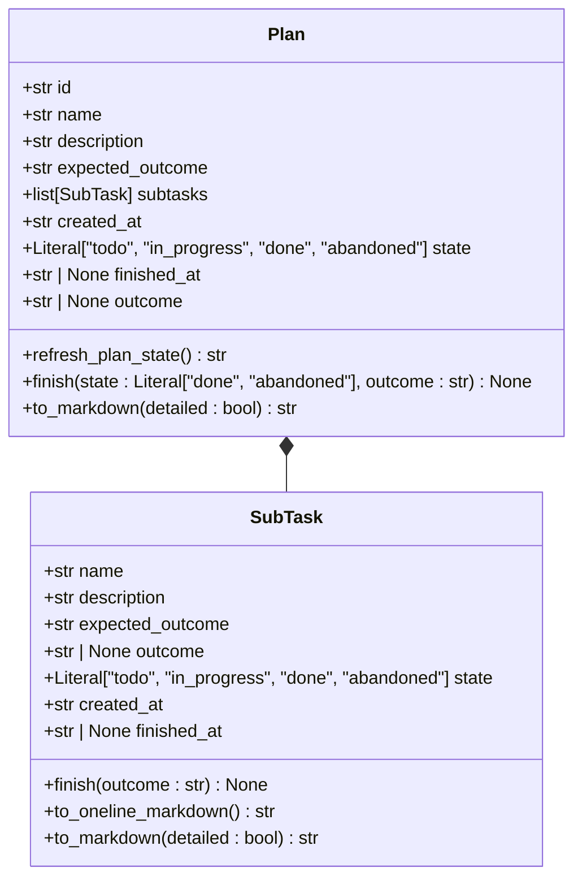
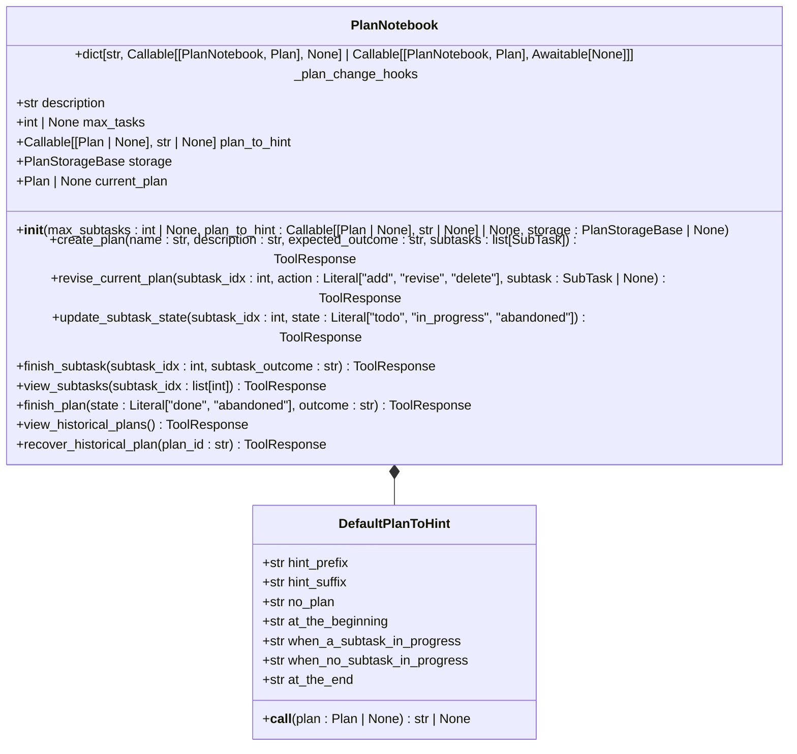
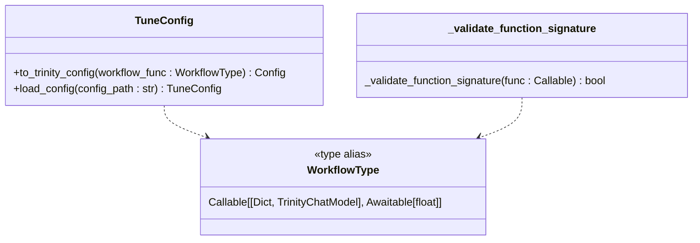
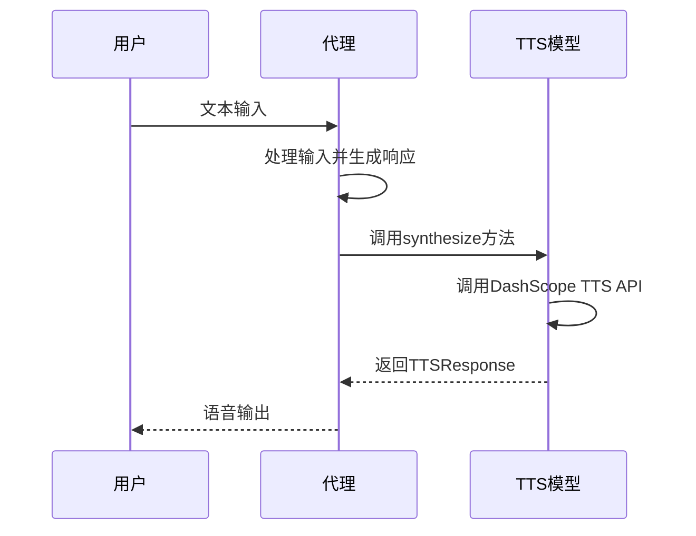
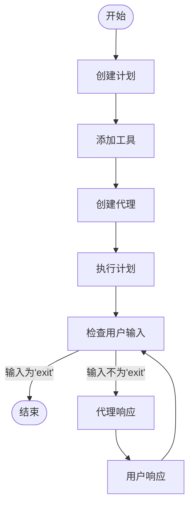

# 高级功能

<cite>
**本文档中引用的文件**  
- [__init__.py](file://src\agentscope\tts\__init__.py)
- [_tts_base.py](file://src\agentscope\tts\_tts_base.py)
- [_dashscope_tts_model.py](file://src\agentscope\tts\_dashscope_tts_model.py)
- [_gemini_tts_model.py](file://src\agentscope\tts\_gemini_tts_model.py)
- [_openai_tts_model.py](file://src\agentscope\tts\_openai_tts_model.py)
- [main.py](file://examples\functionality\tts\main.py)
- [README.md](file://examples\functionality\tts\README.md)
- [_plan_model.py](file://src\agentscope\plan\_plan_model.py)
- [_plan_notebook.py](file://src\agentscope\plan\_plan_notebook.py)
- [main_manual_plan.py](file://examples\functionality\plan\main_manual_plan.py)
- [main_agent_managed_plan.py](file://examples\functionality\plan\main_agent_managed_plan.py)
- [README.md](file://examples\functionality\plan\README.md)
- [_tune.py](file://src\agentscope\tune\_tune.py)
- [_workflow.py](file://src\agentscope\tune\_workflow.py)
</cite>

## 目录
1. [引言](#引言)
2. [TTS（文本转语音）功能](#tts文本转语音功能)
3. [计划系统（Plan）](#计划系统plan)
4. [调优模块（Tune）](#调优模块tune)
5. [高级功能集成示例](#高级功能集成示例)
6. [性能特征与资源需求](#性能特征与资源需求)
7. [配置指南与最佳实践](#配置指南与最佳实践)
8. [扩展可能性](#扩展可能性)
9. [结论](#结论)

## 引言
本文档全面介绍AgentScope框架中的高级功能，包括TTS（文本转语音）功能的实现和使用、计划系统（Plan）的设计原理和应用场景，以及调优模块（Tune）的超参数优化能力。通过实际示例展示复杂应用的构建，如语音交互系统和自动化规划代理，并讨论这些功能的性能特征和资源需求。

## TTS（文本转语音）功能

AgentScope框架提供了强大的TTS（文本转语音）功能，支持多种提供商的集成，包括DashScope、Gemini和OpenAI。TTS功能允许代理将文本响应转换为语音输出，从而实现更自然的语音交互体验。

TTS功能的核心是`TTSModelBase`基类，它定义了所有TTS模型的通用抽象。该基类支持实时和非实时TTS模型，并提供了`synthesize`方法用于从输入文本合成语音。对于实时TTS模型，其生命周期通过异步上下文管理器或调用`connect`和`close`方法进行管理。

**图表来源**
- [src\agentscope\tts\_tts_base.py](file://src\agentscope\tts\_tts_base.py#L12-L144)
- [src\agentscope\tts\_dashscope_tts_model.py](file://src\agentscope\tts\_dashscope_tts_model.py#L28-L178)
- [src\agentscope\tts\_gemini_tts_model.py](file://src\agentscope\tts\_gemini_tts_model.py#L19-L211)
- [src\agentscope\tts\_openai_tts_model.py](file://src\agentscope\tts\_openai_tts_model.py#L17-L185)

### DashScope TTS模型
DashScope TTS模型使用MultiModalConversation API实现，支持多种语音和语言类型。该模型通过`synthesize`方法调用DashScope TTS API来合成语音，并支持流式模式。

### Gemini TTS模型
Gemini TTS模型利用Google的GenAI API实现，支持多种预构建语音。该模型通过`synthesize`方法调用Gemini TTS API来合成语音，并支持流式模式。

### OpenAI TTS模型
OpenAI TTS模型使用OpenAI的音频API实现，支持多种语音选项。该模型通过`synthesize`方法调用OpenAI TTS API来合成语音，并支持流式模式。

**章节来源**
- [src\agentscope\tts\__init__.py](file://src\agentscope\tts\__init__.py#L1-L20)
- [src\agentscope\tts\_tts_base.py](file://src\agentscope\tts\_tts_base.py#L12-L144)
- [src\agentscope\tts\_dashscope_tts_model.py](file://src\agentscope\tts\_dashscope_tts_model.py#L28-L178)
- [src\agentscope\tts\_gemini_tts_model.py](file://src\agentscope\tts\_gemini_tts_model.py#L19-L211)
- [src\agentscope\tts\_openai_tts_model.py](file://src\agentscope\tts\_openai_tts_model.py#L17-L185)
- [examples\functionality\tts\main.py](file://examples\functionality\tts\main.py#L1-L57)
- [examples\functionality\tts\README.md](file://examples\functionality\tts\README.md#L1-L14)

## 计划系统（Plan）

AgentScope的计划系统（Plan）提供了一种结构化的方法来管理和执行复杂任务。该系统允许代理创建、管理和执行计划，每个计划由一系列子任务组成。

计划系统的核心组件是`Plan`和`SubTask`模型。`SubTask`表示计划中的单个子任务，包含名称、描述、预期结果和状态等属性。`Plan`则包含一个子任务列表，并提供方法来刷新计划状态和完成计划。

**图表来源**
- [src\agentscope\plan\_plan_model.py](file://src\agentscope\plan\_plan_model.py#L11-L201)

`PlanNotebook`类是计划系统的核心管理器，它提供了创建、修订、更新子任务状态、完成子任务和计划等工具函数。该类还集成了提示生成功能，可以根据当前计划状态为代理提供下一步操作的指导。

**图表来源**
- [src\agentscope\plan\_plan_notebook.py](file://src\agentscope\plan\_plan_notebook.py#L172-L800)

**章节来源**
- [src\agentscope\plan\_plan_model.py](file://src\agentscope\plan\_plan_model.py#L11-L201)
- [src\agentscope\plan\_plan_notebook.py](file://src\agentscope\plan\_plan_notebook.py#L172-L800)
- [examples\functionality\plan\main_manual_plan.py](file://examples\functionality\plan\main_manual_plan.py#L1-L102)
- [examples\functionality\plan\main_agent_managed_plan.py](file://examples\functionality\plan\main_agent_managed_plan.py#L1-L66)
- [examples\functionality\plan\README.md](file://examples\functionality\plan\README.md#L1-L30)

## 调优模块（Tune）

AgentScope的调优模块（Tune）提供了超参数优化能力，允许用户通过配置文件对代理工作流进行训练和优化。该模块的核心是`tune`函数，它接受一个工作流函数和配置路径作为参数。

**图表来源**
- [src\agentscope\tune\_tune.py](file://src\agentscope\tune\_tune.py#L10-L73)
- [src\agentscope\tune\_workflow.py](file://src\agentscope\tune\_workflow.py#L17-L78)

`tune`函数首先验证工作流函数的签名是否符合`WorkflowType`的要求，然后加载配置文件并将其转换为Trinity-RFT兼容的配置，最后调用`run_stage`函数执行训练阶段。

**章节来源**
- [src\agentscope\tune\_tune.py](file://src\agentscope\tune\_tune.py#L10-L73)
- [src\agentscope\tune\_workflow.py](file://src\agentscope\tune\_workflow.py#L17-L78)

## 高级功能集成示例

### 语音交互系统
通过将TTS功能与ReAct代理集成，可以构建一个语音交互系统。在示例中，`ReActAgent`被配置为使用`DashScopeRealtimeTTSModel`，从而能够实时语音化其响应。

**图表来源**
- [examples\functionality\tts\main.py](file://examples\functionality\tts\main.py#L19-L56)

### 自动化规划代理
通过将计划系统与ReAct代理集成，可以构建一个自动化规划代理。在手动指定计划的示例中，首先创建一个包含多个子任务的计划，然后让代理按计划执行任务。

**图表来源**
- [examples\functionality\plan\main_manual_plan.py](file://examples\functionality\plan\main_manual_plan.py#L23-L101)

在代理管理计划的示例中，代理被赋予创建和管理自己计划的能力，从而能够更自主地处理复杂任务。

**章节来源**
- [examples\functionality\tts\main.py](file://examples\functionality\tts\main.py#L19-L56)
- [examples\functionality\plan\main_manual_plan.py](file://examples\functionality\plan\main_manual_plan.py#L23-L101)
- [examples\functionality\plan\main_agent_managed_plan.py](file://examples\functionality\plan\main_agent_managed_plan.py#L21-L65)

## 性能特征与资源需求
TTS功能的性能主要取决于所使用的TTS提供商的API响应时间和网络延迟。实时TTS模型通常需要持续的网络连接和较高的带宽，而非实时TTS模型则可以在离线模式下缓存语音数据。

计划系统的性能主要取决于计划的复杂性和子任务的数量。对于大型计划，建议使用持久化存储来保存计划状态，以防止在代理重启时丢失进度。

调优模块的性能主要取决于训练数据的大小和复杂性，以及所使用的机器学习框架的效率。该模块需要访问Trinity-RFT库，并可能需要GPU加速来处理大规模训练任务。

## 配置指南与最佳实践
### TTS配置指南
- 选择合适的TTS提供商：根据应用需求选择DashScope、Gemini或OpenAI等提供商。
- 配置API密钥：确保在环境变量中正确设置API密钥。
- 选择合适的语音和语言类型：根据目标用户群体选择最合适的语音和语言设置。
- 启用流式模式：对于实时语音交互，建议启用流式模式以获得更低的延迟。

### 计划系统配置指南
- 定义清晰的子任务：确保每个子任务都有明确的名称、描述和预期结果。
- 使用合理的计划结构：将复杂任务分解为多个可管理的子任务。
- 定期检查计划状态：使用`refresh_plan_state`方法确保计划状态的准确性。
- 使用持久化存储：对于长期运行的计划，建议使用持久化存储来保存计划历史。

### 调优模块配置指南
- 验证工作流函数签名：确保工作流函数符合`WorkflowType`的要求。
- 准备合适的配置文件：使用YAML格式编写详细的训练配置。
- 安装必要的依赖：确保已安装Trinity-RFT和其他必要的机器学习库。

## 扩展可能性
AgentScope的高级功能具有良好的扩展性，可以通过以下方式进一步扩展：
- 集成更多TTS提供商：通过继承`TTSModelBase`基类，可以轻松集成其他TTS服务。
- 扩展计划系统功能：可以添加新的工具函数来支持更复杂的计划管理需求。
- 增强调优模块能力：可以集成更多的机器学习框架和优化算法。

## 结论
AgentScope框架的高级功能为构建复杂的智能代理应用提供了强大的支持。TTS功能实现了自然的语音交互，计划系统提供了结构化的任务管理能力，而调优模块则为代理的持续优化提供了可能。通过合理配置和集成这些功能，可以构建出功能强大、智能高效的代理应用。